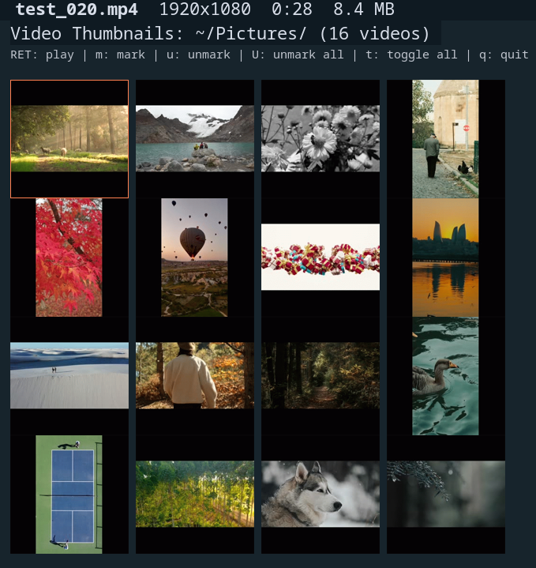

#+TITLE: dired-video-thumbnail
#+AUTHOR: James Dyer
#+OPTIONS: toc:2 num:nil

* Introduction

=dired-video-thumbnail= is an Emacs package that provides =image-dired= style thumbnail viewing for video files. It extracts thumbnails from videos using =ffmpeg= and displays them in a grid layout, allowing you to visually browse and manage video collections directly from Emacs.

#+attr_org: :width 300px
#+attr_html: :width 100%

* Features

- *Thumbnail grid display* - View video thumbnails in a configurable grid layout
- *Persistent caching* - Thumbnails are cached and only regenerated when the source file changes
- *Async generation* - Emacs remains responsive while thumbnails are generated in the background
- *Dired integration* - Marks sync bidirectionally with the associated dired buffer
- *Visual mark indication* - Marked thumbnails display a coloured border (like =image-dired=)
- *Dynamic header line* - Shows filename, dimensions, duration, and file size for the current video
- *Click to play* - Open videos in your preferred external player
- *Cross-platform* - Works on Linux, macOS, and Windows
- *Resizable thumbnails* - Adjust thumbnail size on the fly
- *Sorting* - Sort videos by name, date, size, or duration
- *Filtering* - Filter videos by name pattern, duration range, or file size
- *Recursive search* - Browse videos across subdirectories with optional auto-recursive mode

* Whats New

** <2025-12-15 Mon> 0.2.0

Enhanced package with sorting, filtering, and docs

Added sorting and filtering features to =dired-video-thumbnail=. Introduced customizable options for sorting and filtering criteria, and implement interactive commands for toggling these settings. Included comprehensive documentation in Texinfo format, covering installation, usage, and customization.

* Requirements

- Emacs 28.1 or later
- [[https://ffmpeg.org/][ffmpeg]] and =ffprobe= installed and available in your PATH

* Installation

** Manual

Download =dired-video-thumbnail.el= and place it in your load-path:

#+begin_src emacs-lisp
(add-to-list 'load-path "/path/to/dired-video-thumbnail/")
(require 'dired-video-thumbnail)
#+end_src

** use-package

#+begin_src emacs-lisp
(use-package dired-video-thumbnail
  :load-path "/path/to/dired-video-thumbnail/"
  :bind (:map dired-mode-map
         ("C-t v" . dired-video-thumbnail)))
#+end_src

** straight.el

#+begin_src emacs-lisp
(straight-use-package
 '(dired-video-thumbnail :type git :host github :repo "captainflasmr/dired-video-thumbnail"))
#+end_src

* Usage

** Basic Usage

1. Open a directory containing video files in dired
2. Run =M-x dired-video-thumbnail=
3. A new buffer opens displaying thumbnails for all videos in the directory
4. The cursor automatically moves to the first thumbnail

** With Marked Files

1. In dired, mark specific video files with =m=
2. Run =M-x dired-video-thumbnail=
3. Only thumbnails for the marked videos are displayed

** Recursive Mode

To include videos from subdirectories:

- Use =C-u M-x dired-video-thumbnail= (with prefix argument)
- Or run =M-x dired-video-thumbnail-recursive=
- Or press =R= in the thumbnail buffer to toggle recursive mode

When =dired-video-thumbnail-auto-recursive= is enabled (the default), the package automatically searches subdirectories if the current directory contains no video files.

** Suggested Keybinding

Add a keybinding in dired for quick access:

#+begin_src emacs-lisp
(with-eval-after-load 'dired
  (define-key dired-mode-map (kbd "C-t v") #'dired-video-thumbnail))
#+end_src

* Header Line

As you navigate between thumbnails, the header line dynamically displays information about the current video:

- *Mark indicator* - A red =*= if the video is marked
- *Filename* - The video filename in bold
- *Dimensions* - Video resolution (e.g., =1920x1080=)
- *Duration* - Video length (e.g., =5:32= or =1:23:45=)
- *File size* - Size in MB (e.g., =45.2 MB=)

The header also shows current sort settings (e.g., =[name ↑]=), active filters, and a =[recursive]= indicator when browsing subdirectories.

* Keybindings

In the =*Video Thumbnails*= buffer:

** Navigation

| Key       | Command                              | Description                       |
|-----------+--------------------------------------+-----------------------------------|
| =n=       | ~dired-video-thumbnail-next~         | Move to next thumbnail            |
| =p=       | ~dired-video-thumbnail-previous~     | Move to previous thumbnail        |
| =SPC=     | ~dired-video-thumbnail-play~         | Play video at point               |
| =C-f=     | ~dired-video-thumbnail-forward~      | Move to next thumbnail            |
| =C-b=     | ~dired-video-thumbnail-backward~     | Move to previous thumbnail        |
| =<right>= | ~dired-video-thumbnail-forward~      | Move to next thumbnail            |
| =<left>=  | ~dired-video-thumbnail-backward~     | Move to previous thumbnail        |
| =<up>=    | ~dired-video-thumbnail-previous-row~ | Move up one row                   |
| =<down>=  | ~dired-video-thumbnail-next-row~     | Move down one row                 |
| =d=       | ~dired-video-thumbnail-goto-dired~   | Switch to associated dired buffer |
| =q=       | ~quit-window~                        | Close the thumbnail buffer        |
| =Q=       | ~dired-video-thumbnail-quit-and-kill~| Quit and kill the buffer          |

** Playback

| Key       | Command                      | Description         |
|-----------+------------------------------+---------------------|
| =RET=     | ~dired-video-thumbnail-play~ | Play video at point |
| =o=       | ~dired-video-thumbnail-play~ | Play video at point |
| =mouse-1= | ~dired-video-thumbnail-play~ | Play video (click)  |

On Linux, videos open with =xdg-open=. On macOS, they open with =open=. On Windows, they open with the system default player. You can also specify a custom player.

** Marking

Marks are synchronised with the associated dired buffer, so marking a video in the thumbnail view also marks it in dired, and vice versa.

| Key       | Command                                  | Description                   |
|-----------+------------------------------------------+-------------------------------|
| =m=       | ~dired-video-thumbnail-mark~             | Mark video and move to next   |
| =u=       | ~dired-video-thumbnail-unmark~           | Unmark video and move to next |
| =mouse-3= | ~dired-video-thumbnail-toggle-mark~      | Toggle mark (right-click)     |
| =M=       | ~dired-video-thumbnail-mark-all~         | Mark all videos               |
| =U=       | ~dired-video-thumbnail-unmark-all~       | Unmark all videos             |
| =t=       | ~dired-video-thumbnail-toggle-all-marks~ | Invert all marks              |

** Deletion

| Key | Command                               | Description                               |
|-----+---------------------------------------+-------------------------------------------|
| =D= | ~dired-video-thumbnail-delete~        | Delete video at point (with confirmation) |
| =x= | ~dired-video-thumbnail-delete-marked~ | Delete marked videos (with confirmation)  |

** Display

| Key | Command                                | Description                            |
|-----+----------------------------------------+----------------------------------------|
| =+= | ~dired-video-thumbnail-increase-size~  | Increase thumbnail size                |
| =-= | ~dired-video-thumbnail-decrease-size~  | Decrease thumbnail size                |
| =r= | ~dired-video-thumbnail-refresh~        | Refresh the display                    |
| =w= | ~dired-video-thumbnail-toggle-wrap~    | Toggle wrap mode (flow vs fixed cols)  |
| =R= | ~dired-video-thumbnail-toggle-recursive~ | Toggle recursive directory search    |
| =g= | ~dired-video-thumbnail-regenerate~     | Regenerate thumbnail at point          |
| =G= | ~dired-video-thumbnail-regenerate-all~ | Regenerate all thumbnails              |

** Sorting

| Key  | Command                               | Description              |
|------+---------------------------------------+--------------------------|
| =S=  | ~dired-video-thumbnail-sort~          | Interactive sort menu    |
| =sn= | ~dired-video-thumbnail-sort-by-name~  | Sort by filename         |
| =sd= | ~dired-video-thumbnail-sort-by-date~  | Sort by modification date|
| =ss= | ~dired-video-thumbnail-sort-by-size~  | Sort by file size        |
| =sD= | ~dired-video-thumbnail-sort-by-duration~ | Sort by video duration|
| =sr= | ~dired-video-thumbnail-sort-reverse~  | Reverse sort order       |

** Filtering

| Key  | Command                                  | Description              |
|------+------------------------------------------+--------------------------|
| =\=  | ~dired-video-thumbnail-filter~           | Interactive filter menu  |
| =/n= | ~dired-video-thumbnail-filter-by-name~   | Filter by name regexp    |
| =/d= | ~dired-video-thumbnail-filter-by-duration~ | Filter by duration range |
| =/s= | ~dired-video-thumbnail-filter-by-size~   | Filter by size range     |
| =/c= | ~dired-video-thumbnail-filter-clear~     | Clear all filters        |
| =//= | ~dired-video-thumbnail-filter-clear~     | Clear all filters        |

** Help

| Key | Command                       | Description |
|-----+-------------------------------+-------------|
| =h= | ~dired-video-thumbnail-help~  | Show help   |
| =?= | ~dired-video-thumbnail-help~  | Show help   |

* Customisation

All customisation options are in the =dired-video-thumbnail= group. Use =M-x customize-group RET dired-video-thumbnail RET= to browse them interactively.

** Thumbnail Cache Location

Thumbnails are stored in =~/.emacs.d/dired-video-thumbnails/= by default:

#+begin_src emacs-lisp
(setq dired-video-thumbnail-cache-dir "~/path/to/cache/")
#+end_src

** Thumbnail Size

Control the generated thumbnail size and display height:

#+begin_src emacs-lisp
(setq dired-video-thumbnail-size 200)           ;; Generated thumbnail size (pixels)
(setq dired-video-thumbnail-display-height 150) ;; Display height in buffer
#+end_src

Thumbnails are generated as squares to ensure consistent grid alignment regardless of video aspect ratio.

** Grid Layout

Set the number of columns in the thumbnail grid:

#+begin_src emacs-lisp
(setq dired-video-thumbnail-columns 4)
#+end_src

** Wrap Display

Control whether thumbnails wrap to fill the window width:

#+begin_src emacs-lisp
(setq dired-video-thumbnail-wrap-display t)   ;; Wrap to window width (default)
(setq dired-video-thumbnail-wrap-display nil) ;; Use fixed columns
(setq dired-video-thumbnail-spacing 4)        ;; Spacing between thumbnails (pixels)
#+end_src

** Thumbnail Timestamp

By default, thumbnails are extracted at 5 seconds into the video. Change this to get a more representative frame:

#+begin_src emacs-lisp
(setq dired-video-thumbnail-timestamp "00:00:10")  ;; 10 seconds in
(setq dired-video-thumbnail-timestamp "00:01:00")  ;; 1 minute in
(setq dired-video-thumbnail-timestamp nil)         ;; Let ffmpeg choose
#+end_src

** Video Player

Set your preferred video player:

#+begin_src emacs-lisp
(setq dired-video-thumbnail-video-player "mpv")
(setq dired-video-thumbnail-video-player "vlc")
(setq dired-video-thumbnail-video-player nil)  ;; Use system default
#+end_src

When set to =nil= (the default), videos open with:
- Linux: =xdg-open=
- macOS: =open=
- Windows: System default player (e.g., Films & TV)

** Video Extensions

Add or modify recognised video file extensions:

#+begin_src emacs-lisp
(setq dired-video-thumbnail-video-extensions
      '("mp4" "mkv" "avi" "mov" "webm" "m4v" "wmv" "flv" "mpeg" "mpg" "ogv" "3gp"))
#+end_src

** Mark Border Appearance

Marked thumbnails are indicated with a coloured border. Customise the border width and colour:

#+begin_src emacs-lisp
(setq dired-video-thumbnail-mark-border-width 4)  ;; Border width in pixels

;; Change border colour via the face
(set-face-foreground 'dired-video-thumbnail-mark "blue")
#+end_src

** Default Sorting

Set the default sort criteria and order:

#+begin_src emacs-lisp
(setq dired-video-thumbnail-sort-by 'name)       ;; Options: name, date, size, duration
(setq dired-video-thumbnail-sort-order 'ascending) ;; Options: ascending, descending
#+end_src

** Recursive Search

Control recursive directory searching behaviour:

#+begin_src emacs-lisp
(setq dired-video-thumbnail-recursive nil)       ;; Always search recursively
(setq dired-video-thumbnail-auto-recursive t)    ;; Auto-recursive when no local videos (default)
#+end_src

When =dired-video-thumbnail-auto-recursive= is enabled and the current directory has no video files but has subdirectories, the package automatically searches recursively.

** ffmpeg Path

If ffmpeg/ffprobe are not in your PATH:

#+begin_src emacs-lisp
(setq dired-video-thumbnail-ffmpeg-program "/usr/local/bin/ffmpeg")
(setq dired-video-thumbnail-ffprobe-program "/usr/local/bin/ffprobe")
#+end_src

* Example Configuration

#+begin_src emacs-lisp
(use-package dired-video-thumbnail
  :load-path "/path/to/dired-video-thumbnail/"
  :bind (:map dired-mode-map
         ("C-t v" . dired-video-thumbnail))
  :custom
  (dired-video-thumbnail-size 250)
  (dired-video-thumbnail-display-height 180)
  (dired-video-thumbnail-columns 5)
  (dired-video-thumbnail-timestamp "00:00:10")
  (dired-video-thumbnail-video-player nil)  ;; Use system default
  (dired-video-thumbnail-mark-border-width 5)
  (dired-video-thumbnail-sort-by 'date)
  (dired-video-thumbnail-sort-order 'descending)
  (dired-video-thumbnail-auto-recursive t)
  :custom-face
  (dired-video-thumbnail-mark ((t (:foreground "orange")))))
#+end_src

* Cache Management

Thumbnails are cached based on the file path and modification time. If you modify a video file, the thumbnail will be automatically regenerated on next view.

Video metadata (dimensions, duration) is also cached in memory to avoid repeated calls to =ffprobe=.

To manually clear the thumbnail cache:

#+begin_src emacs-lisp
M-x dired-video-thumbnail-clear-cache
#+end_src

* Workflow Examples

** Reviewing and Deleting Unwanted Videos

1. Open a directory with videos in dired
2. =C-t v= to open thumbnail view
3. Browse thumbnails with =n=, =p=, =SPC=, or arrow keys
4. Press =D= to delete individual videos, or mark with =m= and delete with =x=

** Selecting Videos for Processing

1. Open thumbnail view with =C-t v=
2. Mark videos you want to process with =m=
3. Press =d= to switch to dired
4. Your marked videos are already selected in dired
5. Use any dired command (=C=, =R=, =!=, etc.) on marked files

** Quick Video Preview

1. In dired, position cursor on a video file
2. =C-t v= opens thumbnail view
3. =RET= to play the video
4. =q= to return to dired

** Finding Large Videos

1. Open thumbnail view with =C-t v=
2. Press =ss= to sort by size
3. Press =sr= to reverse order (largest first)
4. Or filter with =/s= to show only videos above a certain size

** Finding Long Videos

1. Press =sD= to sort by duration
2. Or use =/d= to filter by duration range (e.g., =5:00= to =30:00=)

** Searching by Name

1. Press =/n= and enter a regexp pattern
2. Only matching videos are shown
3. Press =/c= to clear the filter

* Troubleshooting

** Thumbnails not generating

1. Ensure ffmpeg is installed: =ffmpeg -version=
2. Check that ffmpeg is in your PATH or set =dired-video-thumbnail-ffmpeg-program=
3. Try regenerating with =g= on a specific thumbnail

** Placeholder showing instead of thumbnail

Some videos may fail to generate thumbnails if:
- The video is corrupted
- The timestamp is beyond the video duration (try setting =dired-video-thumbnail-timestamp= to =nil=)
- ffmpeg doesn't support the codec

Press =g= on the thumbnail to retry generation.

** Video info not showing in header line

Ensure =ffprobe= is installed (it comes with ffmpeg). Set =dired-video-thumbnail-ffprobe-program= if it's not in your PATH.

** Marks not syncing with dired

Run =M-x dired-video-thumbnail-debug= to check if the dired buffer is properly associated. The output should show a live dired buffer reference.

** Performance with many videos

The package processes up to 4 videos concurrently by default. For directories with hundreds of videos, initial thumbnail generation may take some time, but Emacs remains responsive and thumbnails appear as they complete.

* Related Packages

- [[https://www.gnu.org/software/emacs/manual/html_node/emacs/Image_002dDired.html][image-dired]] - Built-in image thumbnail browser for dired
- [[https://github.com/alexluigit/dirvish][dirvish]] - A modern file manager for Emacs with preview support

* License

GPL-3.0-or-later
